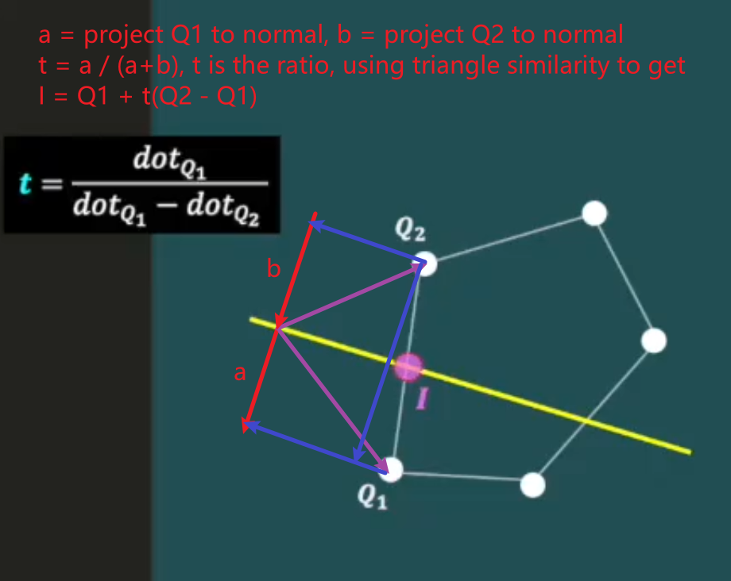

Learn course from:

https://pikuma.com/courses/learn-3d-computer-graphics-programming

用C语言实现只使用CPU进行计算的3D渲染，不用OpenGL，不用GPU。

## Rasterizing Line
### DDA
```c
void draw_line(int x0, int y0, int x1, int y1, uint32_t color) {
    // Digital Differential Analyzer
    int delta_x = (x1 - x0);
    int delta_y = (y1 - y0);
    int longest_side_length =
        (abs(delta_x) >= abs(delta_y)) ? abs(delta_x) : abs(delta_y);
    float x_inc = delta_x / (float)longest_side_length;
    float y_inc = delta_y / (float)longest_side_length;
    float current_x = x0;
    float current_y = y0;
    for (int i = 0; i <= longest_side_length; i++) {
        draw_pixel(round(current_x), round(current_y), color);
        current_x += x_inc;
        current_y += y_inc;
    }
}
```

## Triangle Fill
### Flat-Top + Flat-Bottom


```c
void draw_filled_triangle(int x0, int y0, float z0, float w0, int x1, int y1,
                          float z1, float w1, int x2, int y2, float z2,
                          float w2, uint32_t color) {
    // Sort to make y0 < y1 < y2
    if (y0 > y1) {
        int_swap(&y0, &y1);
        int_swap(&x0, &x1);
        float_swap(&z0, &z1);
        float_swap(&w0, &w1);
    }
    if (y1 > y2) {
        int_swap(&y1, &y2);
        int_swap(&x1, &x2);
        float_swap(&z1, &z2);
        float_swap(&w1, &w2);
    }
    if (y0 > y1) {
        int_swap(&y0, &y1);
        int_swap(&x0, &x1);
        float_swap(&z0, &z1);
        float_swap(&w0, &w1);
    }

    vec4_t point_a = {x0, y0, z0, w0};
    vec4_t point_b = {x1, y1, z1, w1};
    vec4_t point_c = {x2, y2, z2, w2};

    // Flat bottom
    float inv_slope1 = 0;
    float inv_slope2 = 0;
    if (y1 - y0 != 0) {
        inv_slope1 = (float)(x1 - x0) / abs(y1 - y0);
    }
    if (y2 - y0 != 0) {
        inv_slope2 = (float)(x2 - x0) / abs(y2 - y0);
    }
    if (y1 - y0 != 0) {
        for (int y = y0; y < y1; y++) {
            int x_start = x1 + (y - y1) * inv_slope1;
            int x_end = x0 + (y - y0) * inv_slope2;
            if (x_end < x_start) {
                int_swap(&x_start, &x_end);
            }
            for (int x = x_start; x <= x_end; x++) {
                draw_triangle_pixel(x, y, color, point_a, point_b, point_c);
            }
        }
    }

    // Flat top
    inv_slope1 = 0;
    inv_slope2 = 0;
    if (y2 - y1 != 0) {
        inv_slope1 = (float)(x2 - x1) / abs(y2 - y1);
    }
    if (y2 - y0 != 0) {
        inv_slope2 = (float)(x2 - x0) / abs(y2 - y0);
    }
    if (y2 - y1 != 0) {
        for (int y = y1; y <= y2; y++) {
            int x_start = x1 + (y - y1) * inv_slope1;
            int x_end = x0 + (y - y0) * inv_slope2;
            if (x_end < x_start) {
                int_swap(&x_start, &x_end);
            }
            for (int x = x_start; x <= x_end; x++) {
                draw_triangle_pixel(x, y, color, point_a, point_b, point_c);
            }
        }
    }
}
```

## Painter's Algorithm
```c
// Can only sort the triangles,
// like SVG can only sort the path elements,
// this can not compare depth on pixel level.
// Bubble sort bigger avg_depth to the front of array
int num_triangles = array_length(triangles_to_render);
for (int i = 0; i < num_triangles - 1; i++) {
    for (int j = i + 1; j < num_triangles; j++) {
        if (triangles_to_render[i].avg_depth <
            triangles_to_render[j].avg_depth) {
            triangle_t t = triangles_to_render[i];
            triangles_to_render[i] = triangles_to_render[j];
            triangles_to_render[j] = t;
        }
    }
}
```


## Orthographic Projection
Orthographic projection is a method of representing three-dimensional objects in two dimensions. Unlike perspective projection, where objects farther from the viewer appear smaller, orthographic projection maintains the object's dimensions regardless of depth, ensuring that parallel lines remain parallel.

课程只是简单的把点的z轴去掉，直接在屏幕坐标中显示点的x轴和y轴的坐标，没有进行缩放。

https://learnwebgl.brown37.net/08_projections/projections_ortho.html

$$
\begin{bmatrix}
\frac{2}{right - left} & 0 & 0 & 0 \\
0 & \frac{2}{top - bottom} & 0 & 0 \\
0 & 0 & \frac{2}{far - near} & 0 \\
0 & 0 & 0 & 1
\end{bmatrix}
*
\begin{bmatrix}
1 & 0 & 0 & -\frac{right + left}{2} \\
0 & 1 & 0 & -\frac{top + bottom}{2} \\
0 & 0 & 1 & -\frac{far + near}{2} \\
0 & 0 & 0 & 1
\end{bmatrix}
$$
得到
$$P_{ortho} =
\begin{bmatrix}
\frac{2}{r - l} & 0 & 0 & -\frac{r + l}{r - l} \\
0 & \frac{2}{t - b} & 0 & -\frac{t + b}{t - b} \\
0 & 0 & -\frac{2}{f - n} & -\frac{f + n}{f - n} \\
0 & 0 & 0 & 1
\end{bmatrix}$$

矩阵的含义：

先用点的x坐标减去中点，求得到中点的距离。

然后用到中点的距离除以边界之间的总距离，处理后x位于[-0.5,0.5]。

然后再乘以2，让x位于[-1,1]。

## Transformation
Scale first, then rotate and finally translate. The reason is because usually you want the scaling to happen along the axis of the object and rotation about the center of the object.
### Scale
```c
mat4_t mat4_make_scale(float sx, float sy, float sz) {
    mat4_t m = mat4_identity();
    m.m[0][0] = sx;
    m.m[1][1] = sy;
    m.m[2][2] = sz;
    return m;
}
```
### Rotation


$$\cos(\alpha + \beta) = \cos\alpha \cos\beta - \sin\alpha \sin\beta$$
$$\sin(\alpha + \beta) = \sin\alpha \cos\beta + \cos\alpha \sin\beta$$
$$x' = r\cos(\alpha + \beta) = r\cos\alpha \cos\beta - r\sin\alpha \sin\beta = x \cos\beta - y \sin\beta$$
$$y' = r\sin(\alpha + \beta) = r\sin\alpha \cos\beta + r\cos\alpha \sin\beta = y \cos\beta + x \sin\beta$$
$$\begin{pmatrix}x' \\ y'\end{pmatrix}=\begin{pmatrix}\cos\theta & -\sin\theta \\ \sin\theta & \cos\theta\end{pmatrix}\begin{pmatrix}x \\y\end{pmatrix}$$
$$R_z(\theta) = \begin{pmatrix}\cos\theta & -\sin\theta & 0 \\\sin\theta & \cos\theta & 0 \\0 & 0 & 1\end{pmatrix}$$
$$R_x(\theta) = \begin{pmatrix}1 & 0 & 0 \\ 0 &\cos\theta & -\sin\theta \\ 0 & \sin\theta & \cos\theta\end{pmatrix}$$
$$R_y(\theta) = \begin{pmatrix}\cos\theta & 0 & \sin\theta \\ 0 & 1 & 0 \\ -\sin\theta & 0 & \cos\theta \end{pmatrix}$$

y轴sin的符号是反的，是为了在看向y轴正方向时，让逆时针方向是角度增大的方向。

对于左手坐标系和右手坐标系，旋转矩阵是完全一样的，但是对于raymarching，旋转的对象是ray point而不是vertex，所以角度要加一个负号。
```c
mat4_t mat4_make_rotation_z(float angle) {
    float c = cos(angle);
    float s = sin(angle);
    /*
     * | c -s 0 0 |
     * | s  c 0 0 |
     * | 0  0 1 0 |
     * | 0  0 0 1 |
     */
    mat4_t m = mat4_identity();
    m.m[0][0] = c;
    m.m[0][1] = -s;
    m.m[1][0] = s;
    m.m[1][1] = c;
    return m;
}

mat4_t mat4_make_rotation_x(float angle) {
    float c = cos(angle);
    float s = sin(angle);
    /*
     * | 1 0  0 0 |
     * | 0 c -s 0 |
     * | 0 s  c 0 |
     * | 0 0  0 1 |
     */
    mat4_t m = mat4_identity();
    m.m[1][1] = c;
    m.m[1][2] = -s;
    m.m[2][1] = s;
    m.m[2][2] = c;
    return m;
}

mat4_t mat4_make_rotation_y(float angle) {
    float c = cos(angle);
    float s = sin(angle);
    /*
     * Swap sign of s to keep couterclockwise
     * |  c 0 s 0 |
     * |  0 1 0 0 |
     * | -s 0 c 0 |
     * |  0 0 0 1 |
     */
    mat4_t m = mat4_identity();
    m.m[0][0] = c;
    m.m[0][2] = s;
    m.m[2][0] = -s;
    m.m[2][2] = c;
    return m;
}
```
### Translation


```c
mat4_t mat4_make_translation(float tx, float ty, float tz) {
    mat4_t m = mat4_identity();
    m.m[0][3] = tx;
    m.m[1][3] = ty;
    m.m[2][3] = tz;
    return m;
}
```

### World Matrix
```c
// Create a World Matrix combining scale, rotation and translation
// matrices
world_matrix = mat4_identity();
world_matrix = mat4_mul_mat4(scale_matrix, world_matrix);
world_matrix = mat4_mul_mat4(rotation_matrix_z, world_matrix);
world_matrix = mat4_mul_mat4(rotation_matrix_y, world_matrix);
world_matrix = mat4_mul_mat4(rotation_matrix_x, world_matrix);
world_matrix = mat4_mul_mat4(translation_matrix, world_matrix);
```

## Camera


```c
mat4_t mat4_look_at(vec3_t eye, vec3_t target, vec3_t up) {
    // forward (z)
    vec3_t z = vec3_sub(target, eye);
    vec3_normalize(&z);
    // right (x)
    vec3_t x = vec3_cross(up, z);
    vec3_normalize(&x);
    // up (y)
    vec3_t y = vec3_cross(z, x);
    // The dot product between two vectors in 3D space is indeed related
    // to projection, just like in 2D space.
    // Geometrically, the dot product of two vectors in 3D space measures
    // how much one vector projects onto the other. If the two vectors are
    // perpendicular (have a dot product of 0), then one vector does not
    // project onto the other. If they are parallel, then the dot product is
    // maximized, equal to the product of their magnitudes.
    // Dot product of [x.x, x.y, x.z] and [x, y, z] can be explained as
    // projecting [x, y, z] to new x-axis in camera space, and the length
    // of new x-axis is 1, so it is the x component of that point in camera
    // space.
    mat4_t view_matrix = {.m = {
                              {x.x, x.y, x.z, -vec3_dot(x, eye)},
                              {y.x, y.y, y.z, -vec3_dot(y, eye)},
                              {z.x, z.y, z.z, -vec3_dot(z, eye)},
                              {0, 0, 0, 1},
                          }};
    return view_matrix;
}
```

## Back-face Culling


```c
// Back-face culling
vec3_t face_normal = get_triangle_normal(transformed_vertices);
if (should_cull_backface()) {
    vec3_t origin = {0, 0, 0};
    vec3_t camera_ray =
        vec3_sub(origin, vec3_from_vec4(transformed_vertices[0]));
    // Use dot product to calculate how aligned the camera ray is
    // with the face normal
    float dot_normal_camera = vec3_dot(face_normal, camera_ray);
    // Bypass the triangles that are looking away from the camera
    if (dot_normal_camera < 0) {
        continue;
    }
}
```

## Frustum Clipping


```c
frustum_planes[LEFT_FRUSTUM_PLANE].point = origin;
frustum_planes[LEFT_FRUSTUM_PLANE].normal.x = cos_half_fovx;
frustum_planes[LEFT_FRUSTUM_PLANE].normal.y = 0;
frustum_planes[LEFT_FRUSTUM_PLANE].normal.z = sin_half_fovx;

frustum_planes[RIGHT_FRUSTUM_PLANE].point = origin;
frustum_planes[RIGHT_FRUSTUM_PLANE].normal.x = -cos_half_fovx;
frustum_planes[RIGHT_FRUSTUM_PLANE].normal.y = 0;
frustum_planes[RIGHT_FRUSTUM_PLANE].normal.z = sin_half_fovx;

frustum_planes[TOP_FRUSTUM_PLANE].point = origin;
frustum_planes[TOP_FRUSTUM_PLANE].normal.x = 0;
frustum_planes[TOP_FRUSTUM_PLANE].normal.y = -cos_half_fovy;
frustum_planes[TOP_FRUSTUM_PLANE].normal.z = sin_half_fovy;

frustum_planes[BOTTOM_FRUSTUM_PLANE].point = origin;
frustum_planes[BOTTOM_FRUSTUM_PLANE].normal.x = 0;
frustum_planes[BOTTOM_FRUSTUM_PLANE].normal.y = cos_half_fovy;
frustum_planes[BOTTOM_FRUSTUM_PLANE].normal.z = sin_half_fovy;

frustum_planes[NEAR_FRUSTUM_PLANE].point = vec3_new(0, 0, z_near);
frustum_planes[NEAR_FRUSTUM_PLANE].normal.x = 0;
frustum_planes[NEAR_FRUSTUM_PLANE].normal.y = 0;
frustum_planes[NEAR_FRUSTUM_PLANE].normal.z = 1;

frustum_planes[FAR_FRUSTUM_PLANE].point = vec3_new(0, 0, z_far);
frustum_planes[FAR_FRUSTUM_PLANE].normal.x = 0;
frustum_planes[FAR_FRUSTUM_PLANE].normal.y = 0;
frustum_planes[FAR_FRUSTUM_PLANE].normal.z = -1;
```


### 点面相交


直观理解计算线和平面相交点的算法



### 裁剪三角形的算法


设在平面以内的点的数组是array。

三角形abc，先被右侧平面裁剪。

线段ca和右侧平面相交于点d，把点d添加到array。

点a在右侧平面内，把点a添加到array。

线段ab和右侧平面不相交，不添加相交点。

点b在右侧平面内，把点b添加到数组array。

线段bc和右侧平面相交于点e，把点e添加到array。

点c在右侧平面外，不添加点c。

此时数组array中按顺序有点d,a,b,e，组成多边形dabe。

按同样的算法，用下侧平面依次裁剪线段ed，da，ab，be，得到多边形dfgbe。

然后把多边形dfgbe中每三个点构成一个三角形，图中的三角形应该是以g为起点构造的，得到3个三角形gbe，ged，gdf。

```c
void clip_polygon_against_plane(polygon_t *polygon, int plane) {
    vec3_t plane_point = frustum_planes[plane].point;
    vec3_t plane_normal = frustum_planes[plane].normal;

    vec3_t inside_vertices[MAX_NUM_POLY_VERTICES];
    text2_t inside_texcoords[MAX_NUM_POLY_VERTICES];
    int num_inside_vertices = 0;

    // Start from the first vertex
    vec3_t *current_vertex = &polygon->vertices[0];
    text2_t *current_texcoord = &polygon->texcoords[0];
    // Start from the last vertex
    vec3_t *previous_vertex = &polygon->vertices[polygon->num_vertices - 1];
    text2_t *previous_texcoord = &polygon->texcoords[polygon->num_vertices - 1];

    float current_dot = 0.0f;
    float previous_dot =
        vec3_dot(vec3_sub(*previous_vertex, plane_point), plane_normal);
    while (current_vertex != &polygon->vertices[polygon->num_vertices]) {
        current_dot =
            vec3_dot(vec3_sub(*current_vertex, plane_point), plane_normal);
        // If we changed from inside to outside or from outside to inside
        if (current_dot * previous_dot < 0.0f) {
            // t = dotQ1 / (dotQ1 - dotQ2)
            float t = previous_dot / (previous_dot - current_dot);
            // I = Q1 + t(Q2 - Q1)
            vec3_t intersection_point = {
                .x = float_lerp(previous_vertex->x, current_vertex->x, t),
                .y = float_lerp(previous_vertex->y, current_vertex->y, t),
                .z = float_lerp(previous_vertex->z, current_vertex->z, t)};
            // Use the lerp formula to get the interpolated U and V texture
            // coordinates
            text2_t interpolated_texcoord = {
                .u = float_lerp(previous_texcoord->u, current_texcoord->u, t),
                .v = float_lerp(previous_texcoord->v, current_texcoord->v, t)};

            // Insert the intersection point to the list of "inside
            // vertices"
            inside_vertices[num_inside_vertices] = intersection_point;
            inside_texcoords[num_inside_vertices] = interpolated_texcoord;
            num_inside_vertices++;
        }
        // Current vertex is inside the plane
        if (current_dot > 0) {
            inside_vertices[num_inside_vertices] = *current_vertex;
            inside_texcoords[num_inside_vertices] = *current_texcoord;
            num_inside_vertices++;
        }
        previous_dot = current_dot;
        previous_vertex = current_vertex;
        previous_texcoord = current_texcoord;
        current_vertex++;
        current_texcoord++;
    }
    // At the end, copy the list of inside vertices into the destination
    // polygon
    for (int i = 0; i < num_inside_vertices; i++) {
        polygon->vertices[i] = inside_vertices[i];
        polygon->texcoords[i] = inside_texcoords[i];
    }
    polygon->num_vertices = num_inside_vertices;
}

void clip_polygon(polygon_t *polygon) {
    clip_polygon_against_plane(polygon, LEFT_FRUSTUM_PLANE);
    clip_polygon_against_plane(polygon, RIGHT_FRUSTUM_PLANE);
    clip_polygon_against_plane(polygon, TOP_FRUSTUM_PLANE);
    clip_polygon_against_plane(polygon, BOTTOM_FRUSTUM_PLANE);
    clip_polygon_against_plane(polygon, NEAR_FRUSTUM_PLANE);
    clip_polygon_against_plane(polygon, FAR_FRUSTUM_PLANE);
}
```

### 拆分三角形


## Perspective Projection
The general form of the perspective projection matrix is:
$$
P = \begin{bmatrix}
\frac{2n}{r - l} & 0 & \frac{r + l}{r - l} & 0 \\
0 & \frac{2n}{t - b} & \frac{t + b}{t - b} & 0 \\
0 & 0 & -\frac{f + n}{f - n} & -\frac{2fn}{f - n} \\
0 & 0 & -1 & 0
\end{bmatrix}
$$

Often, a simplified version is used when the field of view (fov), aspect ratio, near plane, and far plane are given. Here’s a common form used with these parameters:

$$
P = \begin{bmatrix}
\frac{1}{\text{aspect} \cdot \tan(\frac{\text{fov}}{2})} & 0 & 0 & 0 \\
0 & \frac{1}{\tan(\frac{\text{fov}}{2})} & 0 & 0 \\
0 & 0 & -\frac{f + n}{f - n} & -\frac{2fn}{f - n} \\
0 & 0 & -1 & 0
\end{bmatrix}
$$

fov is the field of view in the y direction (in radians).

aspect is the aspect ratio (width divided by height).

n is the near clipping plane.

f is the far clipping plane.

这里对于z轴的处理和上面的标准不一样，但是结果仍然正常。

$$
\begin{bmatrix}
t \cdot \text{aspecty} & 0 & 0 & 0 \\
0 & t & 0 & 0 \\
0 & 0 & \frac{zfar}{zfar - znear} & \frac{-znear \cdot zfar}{zfar - znear} \\
0 & 0 & 1 & 0
\end{bmatrix}
$$
$$t=\frac{1}{\tan(\frac{\text{fovy}}{2})}$$


```c
mat4_t mat4_make_perspective(float fovy, float aspecty, float znear,
                             float zfar) {
    // aspecty = height / width,
    mat4_t m = {.m = {{0}}};
    // t = z / x = z / y
    float t = 1 / tan(fovy / 2);
    // x * aspecty = x * (height / width) = x / width * height
    // so x / width = y / height
    // so width of view = height of view, viewport is a square
    // it should be a square to make objects do not distort on x or y
    m.m[0][0] = t * aspecty;
    m.m[1][1] = t;
    m.m[2][2] = zfar / (zfar - znear);
    m.m[2][3] = -znear * zfar / (zfar - znear);
    // For holding the value of z
    m.m[3][2] = 1.0;
    return m;
}

vec4_t mat4_mul_vec4_project(mat4_t mat_proj, vec4_t v) {
    vec4_t result = mat4_mul_vec4(mat_proj, v);
    // Perform perspective divide with original z-value that is now stored in w
    if (result.w != 0.0) {
        result.x /= result.w;
        result.y /= result.w;
        result.z /= result.w;
    }
    return result;
}
```

### 通过fovy计算fovx


```c
// Initialize the perspective projection matrix
float aspectx = (float)get_window_width() / (float)get_window_height();
float aspecty = (float)get_window_height() / (float)get_window_width();
float fovy = 75.0 / 180.0 * M_PI;
float fovx = atan(tan(fovy / 2.0f) * aspectx) * 2.0f;
float znear = 0.1f;
float zfar = 100.0f;
proj_matrix = mat4_make_perspective(fovy, aspecty, znear, zfar);

// Initialize frustum planes with a point and a normal
init_frustum_planes(fovx, fovy, znear, zfar);
```

## Flat Shading
机器是小端的，SDL的RGBA32格式实际上是ABGR8888，是反的，但是A都在最前面的8bits，所以此函数功能正常。
```c
uint32_t light_apply_intensity(uint32_t original_color,
                               float percentage_factor) {
    // On my Windows, color format is ABGR8888, this function can still work
    if (percentage_factor < 0.0) {
        percentage_factor = 0.0;
    }
    if (percentage_factor > 1.0) {
        percentage_factor = 1.0;
    }
    uint32_t a = (original_color & 0xFF000000);
    uint32_t r = (original_color & 0x00FF0000) * percentage_factor;
    uint32_t g = (original_color & 0x0000FF00) * percentage_factor;
    uint32_t b = (original_color & 0x000000FF) * percentage_factor;
    uint32_t new_color =
        a | (r & 0x00FF0000) | (g & 0x0000FF00) | (b & 0x000000FF);
    return new_color;
}

float light_intensity_factor =
    -vec3_dot(face_normal, get_light_direction());
uint32_t triangle_color =
    light_apply_intensity(mesh_face.color, light_intensity_factor);
```

## Texture Mapping
### Barycentric Coordinates


```c
vec3_t barycentric_weights(vec2_t a, vec2_t b, vec2_t c, vec2_t p) {
    vec2_t ac = vec2_sub(c, a);
    vec2_t ab = vec2_sub(b, a);
    vec2_t pc = vec2_sub(c, p);
    vec2_t pb = vec2_sub(b, p);
    vec2_t ap = vec2_sub(p, a);
    float area_parallelogram_abc = ac.x * ab.y - ac.y * ab.x;
    float alpha = (pc.x * pb.y - pc.y * pb.x) / area_parallelogram_abc;
    float beta = (ac.x * ap.y - ac.y * ap.x) / area_parallelogram_abc;
    float gamma = 1.0f - alpha - beta;
    vec3_t weights = {alpha, beta, gamma};
    return weights;
}
```
### Affine Texture Mapping


### Perspective-Correct Texture Mapping
```c
void draw_triangle_texel(int x, int y, upng_t *texture, vec4_t point_a,
                         vec4_t point_b, vec4_t point_c, text2_t a_uv,
                         text2_t b_uv, text2_t c_uv) {
    vec2_t point_p = {x, y};
    vec2_t a = vec2_from_vec4(point_a);
    vec2_t b = vec2_from_vec4(point_b);
    vec2_t c = vec2_from_vec4(point_c);

    vec3_t weights = barycentric_weights(a, b, c, point_p);

    float alpha = weights.x;
    float beta = weights.y;
    float gamma = weights.z;

    // Affine texture mapping, has distortion problem
    // float interpolated_u = u0 * alpha + u1 * beta + u2 * gamma;
    // float interpolated_v = v0 * alpha + v1 * beta + v2 * gamma;

    // Perspective-Correct Texture Mapping
    float interpolated_u;
    float interpolated_v;
    // 1/w is linear, can be interpolated
    float interpolated_reciprocal_w;

    interpolated_u = (a_uv.u / point_a.w) * alpha +
                     (b_uv.u / point_b.w) * beta + (c_uv.u / point_c.w) * gamma;
    interpolated_v = (a_uv.v / point_a.w) * alpha +
                     (b_uv.v / point_b.w) * beta + (c_uv.v / point_c.w) * gamma;
    interpolated_reciprocal_w = (1 / point_a.w) * alpha +
                                (1 / point_b.w) * beta +
                                (1 / point_c.w) * gamma;
    // Perspective correct interpolation
    interpolated_u /= interpolated_reciprocal_w;
    interpolated_v /= interpolated_reciprocal_w;

    // Get the mesh texture width and height dimensions
    int texture_width = upng_get_width(texture);
    int texture_height = upng_get_height(texture);

    // Map the UV coordinate to the full texture width and height
    // x and y are integers, maybe outside of the triangle in math,
    // so use mod to prevent texture buffer overflow
    int tex_x = abs((int)(interpolated_u * texture_width)) % texture_width;
    int tex_y = abs((int)(interpolated_v * texture_height)) % texture_height;

    // Initial value in z-buffer is 1.0f, but
    // w is original z which did not be normalized to [0,1],
    // so we need to interpolate 1/z to do depth comparison,
    // but why use 1/w here?

    // Smaller w is, closer to screen the pixel is, greater 1/w is,
    // adjust 1/w so the pixels that are closer to the camera have smaller
    // values. Why use 1.0 here?
    // (1.0 - positive number) is always less than 1.0 which is the initial
    // value of z-buffer. But what if w is negetive number?
    interpolated_reciprocal_w = 1.0 - interpolated_reciprocal_w;

    // Only draw the pixel if the depth value is less than the one
    // previously stored in the z-buffer
    if (interpolated_reciprocal_w < get_zbuffer_at(x, y)) {
        uint32_t *texture_buffer = (uint32_t *)upng_get_buffer(texture);
        draw_pixel(x, y, texture_buffer[tex_y * texture_width + tex_x]);
        // Update the z-buffer value with the 1/w of this current pixel
        update_zbuffer_at(x, y, interpolated_reciprocal_w);
    }
}
```

### Z-Buffer

## Rendering Pipeline


### Vertex Processing
Vertex Shader: Processes each vertex's attributes and transforms them from object space to clip space using the model, view, and projection matrices.

### Clipping
Primitives are clipped against the view frustum to ensure that only visible portions of primitives are processed further.

### Perspective Divide
After clipping, vertices are transformed from clip space to normalized device coordinates (NDC) by performing the perspective divide. This step divides the x, y, and z components of each vertex by its w component.
$$x_{ndc} = \frac{x_{clip}}{w_{clip}}, \quad y_{ndc} = \frac{y_{clip}}{w_{clip}}, \quad z_{ndc} = \frac{z_{clip}}{w_{clip}}$$

### Viewport Transformation
The normalized device coordinates are then transformed to window coordinates based on the viewport settings. This maps the coordinates to the actual pixel positions on the screen.

### Rasterization Process
Primitive Assembly: Assembles vertices into primitives (points, lines, triangles) after vertex processing.

Fragment Generation: Converts these primitives into fragments (potential pixels). During this step, the rasterizer determines which pixels on the screen are covered by each primitive and generates fragments accordingly.

Interpolation: Interpolates vertex attributes (such as colors, texture coordinates, normals) across the surface of the primitive to assign values to each fragment.

### Fragment Processing
Fragment Shader: Processes each fragment to determine its final color and other attributes.
Depth and Stencil Tests: Determines whether a fragment should be drawn based on its depth and stencil values.

### Blending
Combines the fragment’s color with the color already in the framebuffer based on blending operations.

## Handedness Orientation
### Cross Product
定义：
$$\mathbf{a} \times \mathbf{b} = \left( a_y b_z - a_z b_y, a_z b_x - a_x b_z, a_x b_y - a_y b_x \right)$$
数学计算的方式在左手坐标系和右手坐标系都是这样计算的。


在左手坐标系和右手坐标系中，摄像机的方向都是朝着屏幕内的，要让摄像机看到物体，
都必须让物体位于摄像机前面，在左手坐标系中要放在(0, 0, 1)，在右手坐标系中要放在(0, 0, -1)。

假设在右手坐标系中，有一个三角形abc，a=(0,0,-1), b=(0,1,-1), c=(1,1,-1),
它的face normal = ac cross ab，指向摄像机，摄像机可以看到它，不会被back-face culling去除。

然后把三角形abc的z坐标加上2，把它平移到a=(0,0,1), b=(0,1,1), c=(1,1,1),
然后把摄像机的方向绕y轴旋转180度，让摄像机指向z轴正方向，
然后发现face normal = ac cross ab，face normal仍然指向z轴正方向，但是没有指向摄像机，
会被back-face culling去除，为了让摄像机看到这个三角形，需要让face normal = ab cross ac。

左手坐标系计算cross product的方式和右手坐标系可以保持一致，但是计算face normal
时，选择点构造向量的顺序要相反。


## Pineda's Algorithm

